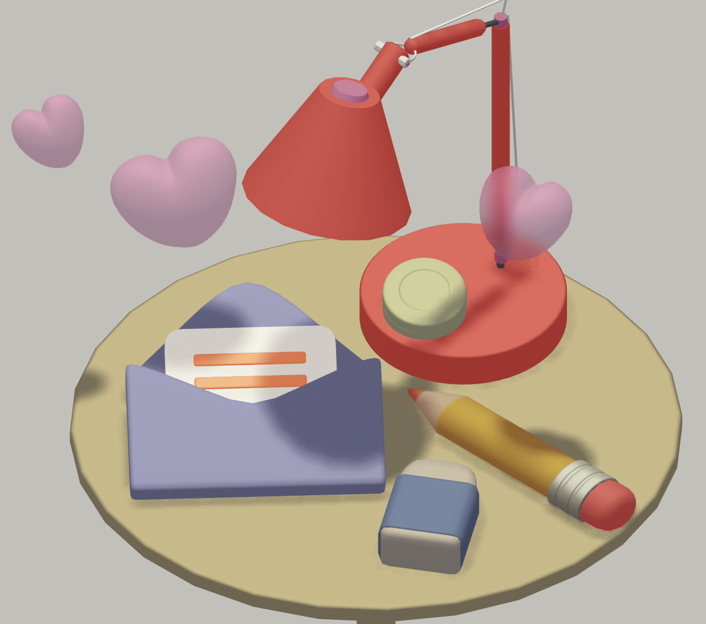
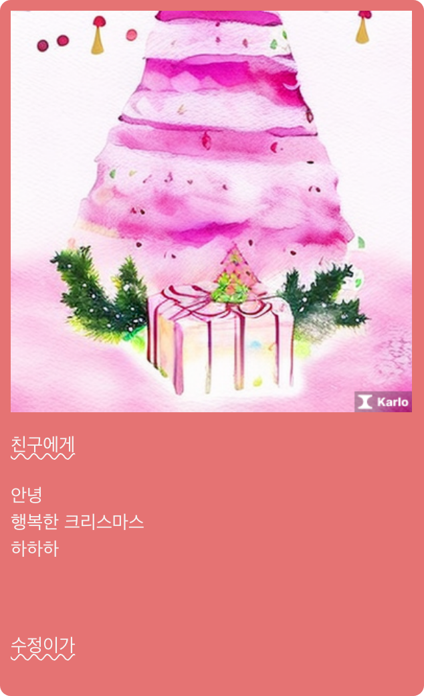

  
    
 
 
  <h1> ✨ AI PostCard 🎨 ✉️ </h1>
  <h3>
This project aims to make  
the annual events' greetings ritual 
<u>simpler, enjoyable, and customizable.</u>   

 

</h3>

<h4>
This project allows users customize the postcard, write messages,  
and get a good illustration drawn by AI,  
which can be saved as an image or shared on SNS.</h4>
    

## Preview

 

## Features

- Postcard Customization
- Message Writing
- Image Customization (By AI)
- Export PostCard to Image
- Share PostCard on SNS

 

## Built With

- [`React`](https://reactjs.org/)
- [`TypeScript`](https://reactjs.org/)
- [`Next.js`](https://reactjs.org/)
- [`Zustand`](https://reactjs.org/)
- [`Spline`](https://reactjs.org/)
- [`Tailwind CSS`](https://reactjs.org/)
- [`Konsta UI`](https://reactjs.org/)
- [`Kakao Karlo API`](https://reactjs.org/)
- [`Kakao Share API`](https://reactjs.org/)
- [`html-to-image`](https://reactjs.org/)

 

## `.env`

NEXT_PUBLIC_KAKAO_API_KEY={kakao_js_api_key }
NEXT_PUBLIC_KAKAO_RESTAPI_KEY={kakao_rest_api_key}

 

## TODO

- 배포
- <버그> '새로작성'후 사진으로저장 혹은 카카오톡 공유 시, 이전에 그려진 이미지가 저장됨
- Spline 수정 (작업중인 노트북으로는 세밀한 수정 불가능..)
  - 초기화면 '편지쓰기' 버튼 수정
  - 이미지생성 로딩화면 수정
- 테스트코드 작성
- 편지지패턴 선택
- SNS 공유: Twitter 추가
- 코드 정리

 

## License

- [`MIT License`]('./LICENSE')
